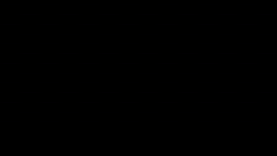

# Flat-Channel Loop Signature (pi_f Health Observable)

<!-- HERO_ANIMATION:BEGIN -->

_Hero animation: **Flat-channel loop signature (π_f health observable)**. [Download high-resolution MP4](images/flat_channel_loop_signature.mp4)._
<!-- HERO_ANIMATION:END -->

**ID:** `eq-flat-channel-loop-signature-pi-f-health-observable`  
**Tier:** derived  
**Score:** 95  
**Units:** OK  
**Theory:** PASS-WITH-ASSUMPTIONS

## Equation

$$
\Sigma_{\Gamma}^{(\pi_f)}(t)=\exp\!\left[\frac{1}{|\Gamma|}\sum_{e\in\Gamma}\ln\!\left(\frac{\pi_{f,e}(t)}{\pi}\right)\right]\,\frac{1+\cos\!\left(\Theta_\Gamma(t)/\pi_a(t)\right)}{2},\quad \Theta_\Gamma(t)=\sum_{e\in\Gamma}\sigma_{\Gamma,e}\,\arg g_e(t),\quad \pi_{f,e}(t)=\pi |g_e(t)|
$$

## Description

Loop-local flat-channel order parameter for HAFC/EGATL lattices. It multiplies the geometric-mean flat-channel field along a selected loop Gamma by a bounded holonomy-coherence factor on the adaptive ruler pi_a. On the top-strip loop surrounding the damaged boundary channel, it acts as a localized loop-health monitor for top-edge failure and recovery rather than a generic bulk transport score.

## Reproducible Artifact Run

Default artifact run: 6x6 lattice, `T=6`, `damage_time=2`, `mass=-1`.

- Pre-damage means: top strip `0.0896`, boundary `0.0630`, central plaquette `0.00930`
- At the damage step: top strip `0.000738` (`0.82%` of pre), boundary `0.003233` (`5.14%` of pre), central plaquette `0.003374` (`36.3%` of pre)
- End-to-end transfer stays high: `0.813` pre window to `0.828` post window

## Repository Layout

- `images/flat_channel_loop_dashboard.png`: dashboard summary of the short damage protocol
- `images/flat_channel_loop_damage.gif`: animated conductance/signature response
- `data/flat_channel_loop_metrics.json`: machine-readable summary metrics
- `data/flat_channel_loop_timeseries.csv`: raw time series used for plotting
- `simulations/generate_flat_channel_loop_artifacts.py`: generator used to produce the artifacts

## Links

- [TopEquations Leaderboard](https://rdm3dc.github.io/TopEquations/leaderboard.html)
- [TopEquations Main Repo](https://github.com/RDM3DC/TopEquations)
- [Certificates](https://rdm3dc.github.io/TopEquations/certificates.html)
